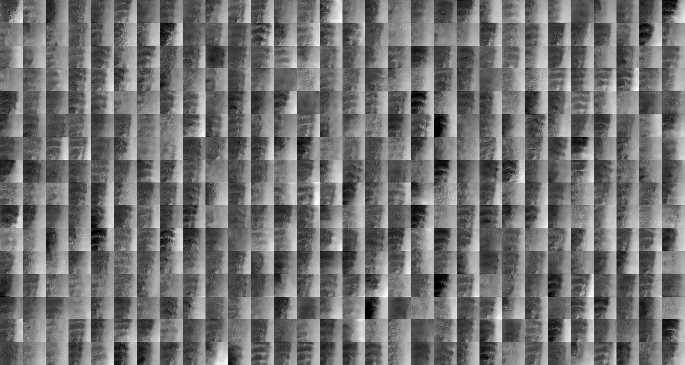
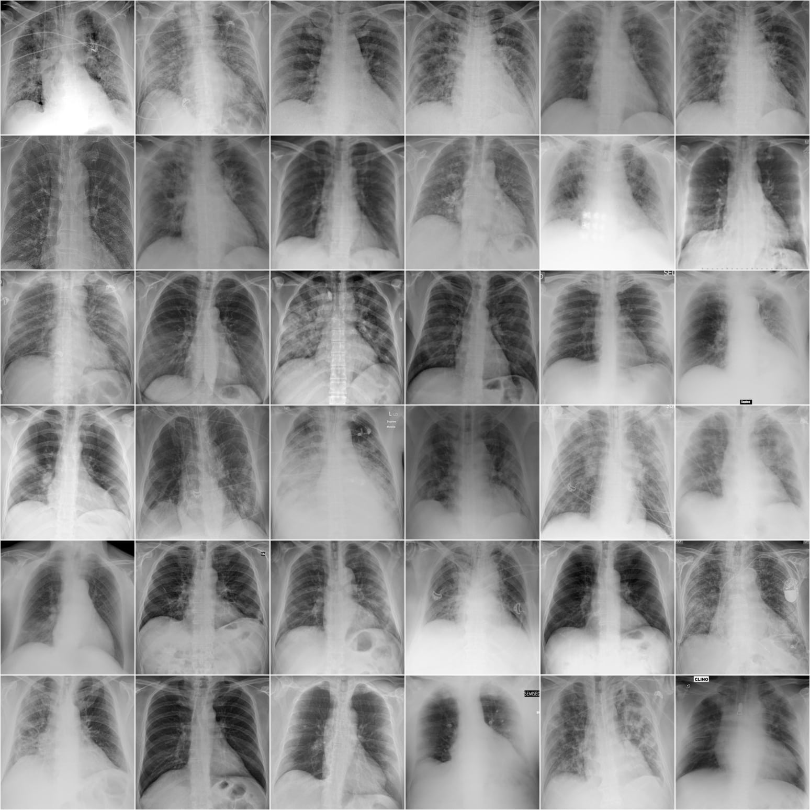
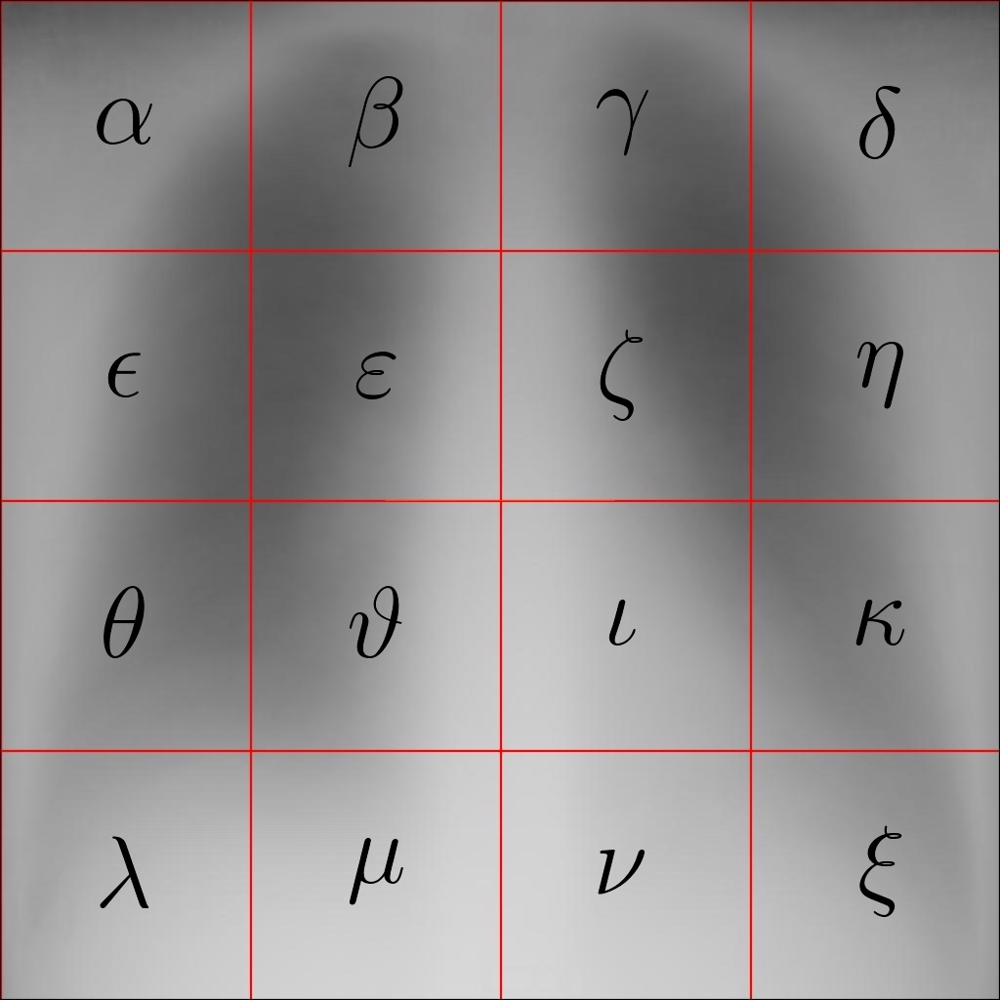

# COVID-19GAN
COVID-19 Generative Adversarial Network 



COVID-19GAN is a StyleGAN2 generative adversarial  network trained on the 'COVID-19 image data collection' Cohen et al. (2020). The goal of COVID-19GAN is to generate photorealistic images chest x-rays (see above) of 2019 Novel Coronavirus COVID-19 (2019-nCoV) patients from a modified dataset of the 'COVID-19 image data collection' images. The above example shows fake chest x-rays of Novel Coronavirus COVID-19 (2019-nCoV) patients in the varepsilon section, see the red annotated grid below for section nomenclature. 

# Requirements

The following requirements are derived from StyleGAN2 requirements. For more information visit: https://github.com/NVlabs/stylegan2. The notebook COVID-19GAN.ipynb in the COVID-19GAN_StyleGan2 folder provides access to COVID-19GAN.

Both Linux and Windows are supported.
Linux is recommended for performance and compatibility reasons.
64-bit Python 3.6 installation. 
Anaconda3 with numpy 1.14.3 or newer.
TensorFlow 1.14 or 1.15 with GPU support. 
The code does not support TensorFlow 2.0.
On Windows, you need to use TensorFlow 1.14 — TensorFlow 1.15 will not work.
One or more high-end NVIDIA GPUs, NVIDIA drivers, CUDA 10.0 toolkit and cuDNN 7.5. 
To reproduce the results reported in the paper StyleGAN2, you need an NVIDIA GPU with at least 16 GB of DRAM.
Docker users: use the provided StyleGAN2 Dockerfile to build an image with the required library dependencies.

# Dataset 



'COVID-19 image data collection' from Cohen et al. (2020) have been cleaned for compatibility with StyleGAN2, see above image. All images have been converted to greyscale, cropped to chest and rescaled to 256x256, 512x512, 1024x1024 and 2048x2048. 



The average 1024x1024 COVID-19 chest x-ray (see above) reveals that segments epsilon, varepsilon, theta and vartheta offer the most promise for applying StyleGan2 to simulate artificial COVID-19 chest x-rays. The 1024x1024 dataset has been segmented into 16x256x256, titled alpha to xi. 4 datasets (epsilon, varepsilon, theta and vartheta) have been refined though manual filtering. The shown example of generated images has been trained on the refined varepsilon chest x-ray dataset. 


# Colab
The following notebook COVID-19GAN.ipynb run on Colab provides access to the COVID-19GAN.  Download COVID-19GAN_StyleGan2, unzip and upload to Google Drive. Open COVID-19GAN.ipynb with Google Colab. Select Runtime, Change runtime type and set the Runtime type to Python 3 and the Hardware accelerator to GPU. Then Run all. You may need to modify some paths.  

# Contact
George Cann, Department of Space and Climate Physics (Mullard Space Science Laboratory), University College London.
Email: george.cann.15@ucl.ac.uk. 

# Citation
```
1. George Cann
COVID-19GAN, (2020)
https://github.com/ghcann/COVID-19GAN
```

```
@article{cann_covid-19gan,
  title={COVID-19GAN},
  author={George Cann},
  url={https://github.com/ghcann/COVID-19GAN},
  year={2020}
}
```

```
2. Joseph Paul Cohen and Paul Morrison and Lan Dao
COVID-19 image data collection, arXiv:2003.11597, 2020
https://github.com/ieee8023/covid-chestxray-dataset
```
```
@article{cohen2020covid,
  title={COVID-19 image data collection},
  author={Joseph Paul Cohen and Paul Morrison and Lan Dao},
  journal={arXiv 2003.11597},
  url={https://github.com/ieee8023/covid-chestxray-dataset},
  year={2020}
}
```

```
3. Tero Karras, Samuli Laine, Miika Aittala, Janne Hellsten, Jaakko Lehtinen, Timo Aila
Analyzing and Improving the Image Quality of StyleGAN
https://github.com/NVlabs/stylegan2
```

```
@article{Karras2019stylegan2,
  title   = {Analyzing and Improving the Image Quality of {StyleGAN}},
  author  = {Tero Karras and Samuli Laine and Miika Aittala and Janne Hellsten and Jaakko Lehtinen and Timo Aila},
  journal = {CoRR},
  volume  = {abs/1912.04958},
  year    = {2019},
}
```

# Acknowledgements

The author would like to thank NVlabs, Tero Karras, Samuli Laine, Miika Aittala, Janne Hellsten, Jaakko Lehtinen, Timo Aila for providing StyleGan2 (https://github.com/NVlabs/stylegan2) and Joseph Paul Cohen and Paul Morrison and Lan Dao for providing the 'COVID-19 image data collection' dataset (https://github.com/ieee8023/
covid-chestxray-dataset). 
